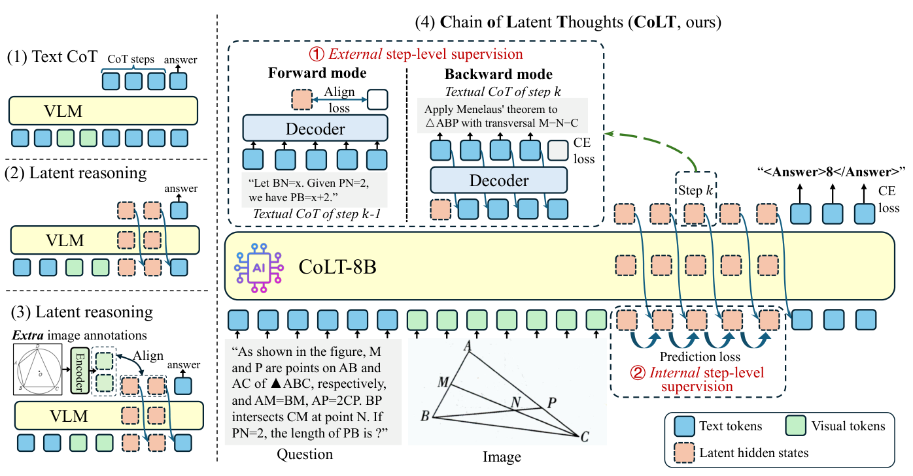
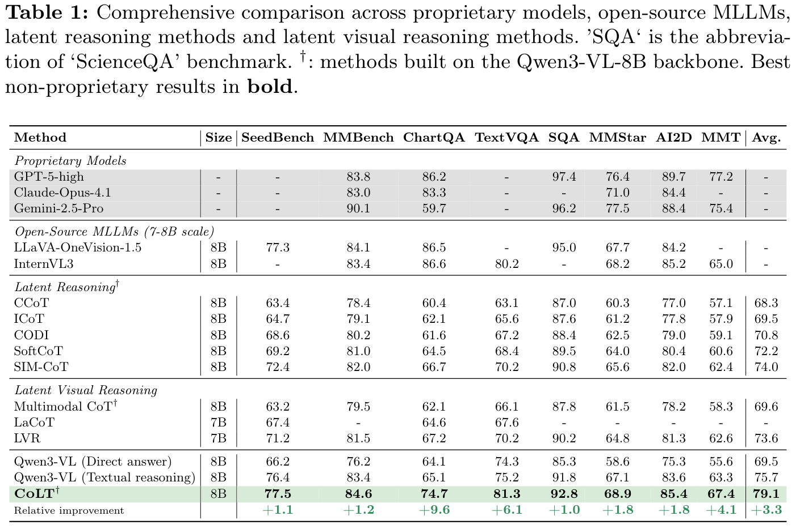
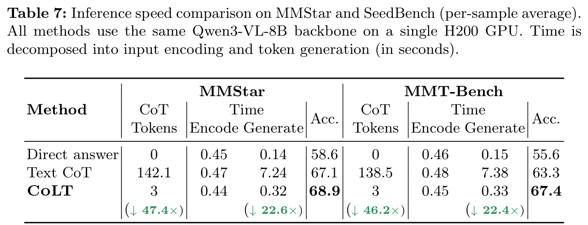

# CoLT: Teaching Multi-Modal Models to Think with Chain of Latent Thoughts (ECCV2026)

[[📖 Paper](https://arxiv.org/)] [[🤗 CoLT-8B-model](https://huggingface.co/OneThink/CoLT-8B)] [[🤗 CoLT-train-data](https://huggingface.co/datasets/hulianyuyy/CoLT_Train_Dataset)] 


## 👀 About CoLT

<div align="center">
  
</div>

We introduce **CoLT**, an latent reasoning model that **reduce the inference time by 10.3× and text decoding time by 20.4×**, while performing **better or comparably** with textual reasoning on some tasks.

Unlike most previous latent reasoning methods (e.g., LVR, LaCoT and MoNet in multimodal reasoning), which use **auxiliary images** to supervise the latent reasoning process and brings **costly annotation costs** with severely limited the training copus, our method adopt **pure textual CoT annotations** for training, which can fully **reduce the burden on labelling additional auxiliary images** and **adopt existing textual CoT annotations**.

**All code, models, and data are fully released.**

## 🔥 News
- [2026/06] We release the code, model, data of CoLT

## 📍 Features

+ Support Qwen3-VL Training
+ Support evaluation on our pretrained models
+ Provide full pipeline (dataset, SFT training, etc) 

## 🔍 Dataset

Our dataset uses the **image subset** of **OneThinker-600k**, a large-scale multi-task training corpus covering fundamental visual reasoning tasks, including rule-based QA, open-ended QA, captioning, spatial grounding, temporal grounding, spatio-temporal grounding, tracking, and segmentation

<div align="center">
  
</div>

## 🏆 Performance

<div align="center">
  
</div>


Our model obtains **significant performance gains** after training based on Qwen3-VL-Instruct-8B across diverse visual tasks. For examle, Compared to textual reasoning with explicit chain-of-thought, CoLT achieves **+3.4%** higher average on eight benchmarks (79.1 vs. 75.7), with the largest gains on **ChartQA (+9.6%), TextVQA (+6.1%), MMStar (+1.8%) and MMT-Bench (+4.1%)**, while using significantly fewer tokens.


<div align="center">
  
</div>

Besides, we also observe significant inference time reduction on visual tasks requiring complex reasoning. For example, on MMStar and MMT-Bench, text CoT requires **7.24s (MMStar)** and **7.38s (MMT-Bench)** to produce **∼142** and **∼139** reasoning tokens respectively, whereas CoLT completes generation in **0.32s** and **0.33s** using only **3 latent vectors**, achieving **22.6× and 22.4× reduction** in generation time.  Overall, CoLT delivers **10.1× (MMStar)** and **10.1× (MMT-Bench)** end-to-end speedup while maintaining higher accuracy


## 📐 Set up

```bash
git clone https://github.com/hulianyuyy/CoLT
cd CoLT

# build SFT environment
conda create -n colt python=3.11 
conda activate colt
cd LLaMA-Factory
pip install -e ".[torch,metrics]" --no-build-isolation

cd .. && cd transformers-4.57.0
pip install -e .

```

For more details for the SFT environment installation, please refer to [LLaMA-Factory](https://github.com/hiyouga/LLaMA-Factory).

Then, download the training datasets [[🤗 CoLT-train-data](https://huggingface.co/datasets/hulianyuyy/CoLT_Train_Dataset)] and unzip all the data.

You can unzip all data by simply running ``python unzip_all_data.py``. Note that you need to first set the root dir in the ``unzip_all_data.py``.

## 🚀 Training

For training, we adopt 8 × 80GB GPUs; alternatively, you can also try to train the model on fewer GPUs (e.g., 2 or 4) with 80GB memory.

The code to start training is:

```bash
bash ./LLaMA-Factory/local_scripts/run_colt_sft.sh
```

## 🔮 Inference & Evaluation
Since CoLT-8B shares the same architecture as Qwen3-VL-8B, it naturally supports easy and efficient inference.

For most visual tasks, we use  [VLMEvalKit](https://github.com/open-compass/VLMEvalKit) for evaluation, you could run:

```bash
cd ./Evaluation/VLMEvalKit
torchrun --nproc-per-node=1 run.py --data your_benchmark --model Qwen3-VL-8B-Instruct-COLT --verbose --reuse
```

``your_benchmark`` should be selected from the supported benchmarks by VLMEvalKit, and you can find them [here](https://aicarrier.feishu.cn/wiki/Qp7wwSzQ9iK1Y6kNUJVcr6zTnPe?table=tblsdEpLieDoCxtb&view=vewUH3kRGs). 

**One GPU** is enough for CoLT to perform inference.

Note that if **as CoLT and Qwen3-VL-8B share the same backbone, if you want to run inference with the original Qwen3-VL-8B, you shuold turn off latent reasoning model by setting ``self.latent_reasoning_mode = False`` in [modeling_qwen3_vl.py](./transformers-4.57.0/src/transformers/models/qwen3_vl/modeling_qwen3_vl.py#L1480)**.

## Acknowledgements

We sincerely appreciate the contributions of the other open-source projects: [LLaMA-Factory](https://github.com/hiyouga/LLaMA-Factory),  [VLMEvalKit](https://github.com/open-compass/VLMEvalKit) and [Onethinker](https://github.com/tulerfeng/OneThinker).

## Citations

If you find our work helpful for your research, please consider citing our work.   

```
@inproceedings{hu2026colt,
  title={CoLT: Teaching Multi-Modal Models to Think with Chain of Latent Thoughts},
  author={Hu, Lianyu and Qin, Shengqian and Liao, Zeqin and Guo, Qing and Wan, Liang and Feng, Wei and Liu, Yang},
  booktitle={Eurean Conference on Computer Vision},
  year={2026}
}
```
